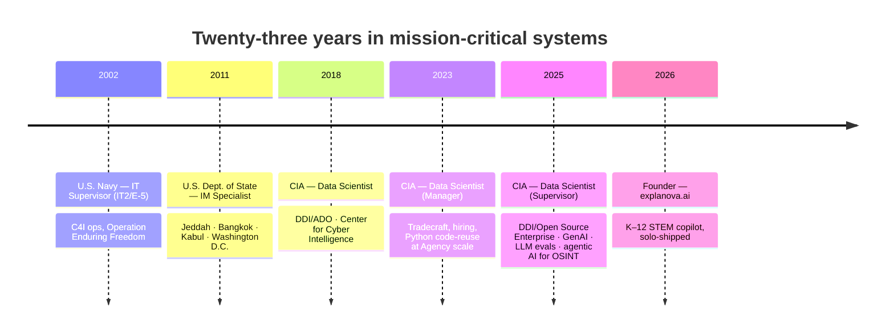

<!-- github.com/stephengardnerd/stephengardnerd/README.md -->
<!-- Special-named repo: renders on Stephen's GitHub profile page -->

<h1 align="center">Stephen D. Gardner</h1>

  <b>AI Product Founder · Federal Data Science Leader · Navy Veteran</b> 
  Shipping GenAI, agentic AI, and LLM-evaluated products — from the IC to K–12 classrooms.

  
  
  
  
  

---

### Building now — [explanova.ai](https://explanova.ai)

A family STEM homework copilot for K–12: avatar-on-whiteboard tutor, GraphRAG grounding, multi-model orchestration, and parent-side controls. Solo-built, live, and the cleanest mirror of my day-job focus areas at consumer scale.

**Case study →** [`explanova-ai-product-case-study`](https://github.com/stephengardnerd/explanova-ai-product-case-study)

---

### Current focus

- **GenAI & LLM evaluations** — rigorous eval harnesses for frontier models in production
- **Agentic AI for sensemaking** — multi-agent orchestration over unstructured, multi-source data
- **Multi-modal search & discovery** — unifying text, vision, and structured retrieval into one UX
- **Knowledge graphs + RAG** — grounding generative output in verifiable, governed data

---

### Career arc

---

### Tech stack

**AI/ML:** NLP · Computer Vision · Knowledge Graphs · GraphRAG · LLM Evals · Agentic AI · AI/ML Ethics
**Infra:** IaC · CI/CD · Kubernetes · Terraform · Cloud (AWS/GCP/Azure)
**Leadership:** AI Product Management · Data Governance · CIA Program Manager L2 · COTR L1

---

### Recognition

- **CIA** — Center for Cyber Intelligence Innovation Award · Meritorious Unit Citation (x2) · Exceptional Performance Award (x8)
- **U.S. Department of State** — Performance Award (x3) · Warzone Assignment Award
- **U.S. Navy** — Navy & Marine Corps Achievement Medal · Global War on Terrorism Expeditionary & Service Medals · NATO Service Medal · National Defense Service Medal · Good Conduct Medal

---

### Education

- **M.S., Management Information Systems** — University of Illinois, Springfield · GPA 3.9 · Graduate Certificate: Business Intelligence · Beta Gamma Sigma
- **B.S., Business Administration** *(cum laude)* — Southern Connecticut State University · Concentration: MIS · GPA 3.6 · Delta Mu Delta

**Certifications:** CompTIA A+ · Network+ · Security+ · Project+ · ITIL v3 · CIA Program Manager L2 · COTR L1

---

### Pinned repositories

1. **[explanova-ai-product-case-study](https://github.com/stephengardnerd/explanova-ai-product-case-study)** — live AI product case study (GraphRAG, multi-model orchestration, K–12 STEM)
2. *(reserve 5 more — let's pick together from your existing public repos)*

---

### Contact

- **Live product:** [explanova.ai](https://explanova.ai)
- **LinkedIn:** [linkedin.com/in/stephengardnerd](https://www.linkedin.com/in/stephengardnerd)
- **GitHub:** [@stephengardnerd](https://github.com/stephengardnerd)
- **Location:** Chantilly, VA (DMV)

Federal AI leader by day · solo AI-product founder by night · 23 years shipping systems that matter.

