<!-- github.com/stephengardnerd/stephengardnerd/README.md -->
<!-- Special-named repo: renders on Stephen's GitHub profile page -->

  

  
  
  
  
  

---

### Featured — [explanova.ai](https://explanova.ai)

<table>
<tr>
<td valign="top" width="32%" align="center">

  
<b>K–12 S.T.E.M. Copilot</b> 
Family homework tutor Solo-built · Live in production
  

</td>
<td valign="top">
<b>The product.</b> A family S.T.E.M. homework copilot for K–12. Avatar-on-whiteboard tutor, GraphRAG grounding, multi-model orchestration, and parent-side controls — the cleanest consumer-scale mirror of my day-job focus areas.
  
<b>Why it matters.</b> Parents don't want an answer machine; they want a tutor that shows the work. Explanova grounds every step in verified curriculum (GraphRAG) so the avatar on the whiteboard teaches instead of hallucinates.
  
<b>Stack.</b>

</td>
</tr>
</table>

---

### Current focus

- **GenAI & LLM evaluations** — rigorous eval harnesses for frontier models in production
- **Agentic AI for sensemaking** — multi-agent orchestration over unstructured, multi-source data
- **Multi-modal search & discovery** — unifying text, vision, and structured retrieval into one UX
- **Knowledge graphs + RAG** — grounding generative output in verifiable, governed data

---

### GitHub activity

  
  

---

### Career arc

<i>Twenty-three years in mission-critical systems</i>

<table>
<tr>
<td align="center" width="16%" valign="top">
 
<b>U.S. Navy</b> 
IT Supervisor · IT2/E-5  
C4I operations Operation Enduring Freedom
</td>
<td align="center" width="16%" valign="top">
 
<b>U.S. Dept. of State</b> 
IM Specialist  
Jeddah · Bangkok Kabul · Washington D.C.
</td>
<td align="center" width="16%" valign="top">
 
<b>Federal IC</b> 
Data Scientist  
Cyber intelligence mission
</td>
<td align="center" width="16%" valign="top">
 
<b>Federal IC</b> 
Data Scientist · Manager  
Tradecraft · hiring Python reuse at enterprise scale
</td>
<td align="center" width="16%" valign="top">
 
<b>Federal IC</b> 
Data Scientist · Supervisor  
Open-source enterprise GenAI · LLM evals · agentic OSINT
</td>
<td align="center" width="16%" valign="top">
 
<b>Founder — explanova.ai</b> 
Solo-built  
K–12 S.T.E.M. copilot live in production
</td>
</tr>
</table>

---

### Tech stack

**AI/ML:** NLP · Computer Vision · Knowledge Graphs · GraphRAG · LLM Evals · Agentic AI · AI/ML Ethics
**Infra:** IaC · CI/CD · Kubernetes · Terraform · Cloud (AWS/GCP/Azure)
**Leadership:** AI Product Management · Data Governance · Federal Program Manager L2 · COTR L1

---

### Recognition

- **Federal IC** — Innovation Award · Meritorious Unit Citation (x2) · Exceptional Performance Award (x8)
- **U.S. Department of State** — Performance Award (x3) · Warzone Assignment Award
- **U.S. Navy** — Navy & Marine Corps Achievement Medal · Global War on Terrorism Expeditionary & Service Medals · NATO Service Medal · National Defense Service Medal · Good Conduct Medal

---

### Education

- **M.S., Management Information Systems** — University of Illinois, Springfield · GPA 3.9 · Graduate Certificate: Business Intelligence · Beta Gamma Sigma
- **B.S., Business Administration** *(cum laude)* — Southern Connecticut State University · Concentration: MIS · GPA 3.6 · Delta Mu Delta

**Certifications:** CompTIA A+ · Network+ · Security+ · Project+ · ITIL v3 · Federal Program Manager L2 · COTR L1

---

### Pinned repositories

1. **[explanova-ai-product-case-study](https://github.com/stephengardnerd/explanova-ai-product-case-study)** — AI product case study, ideation to production: Gemini 3 Pro, GraphRAG, multi-model orchestration, Firebase, Cloud Run, Stripe, Playwright. Live at [explanova.ai](https://explanova.ai).
2. **[DataEngineering_MLPipeline](https://github.com/stephengardnerd/DataEngineering_MLPipeline)** — End-to-end ML pipeline: ETL, NLP classification, and Flask web app for disaster-response message routing (Udacity Data Engineering Nanodegree).
3. **[AI_Product_Management](https://github.com/stephengardnerd/AI_Product_Management)** — AI Product Management portfolio: MVP definition, prioritization, build-vs-buy, medical image annotation, and Google ML submissions from the Duke AI PM program.

---

### Connect

  
  
  

Based in Chantilly, VA · DMV

Federal AI leader by day · solo AI-product founder by night · 23 years shipping systems that matter.

